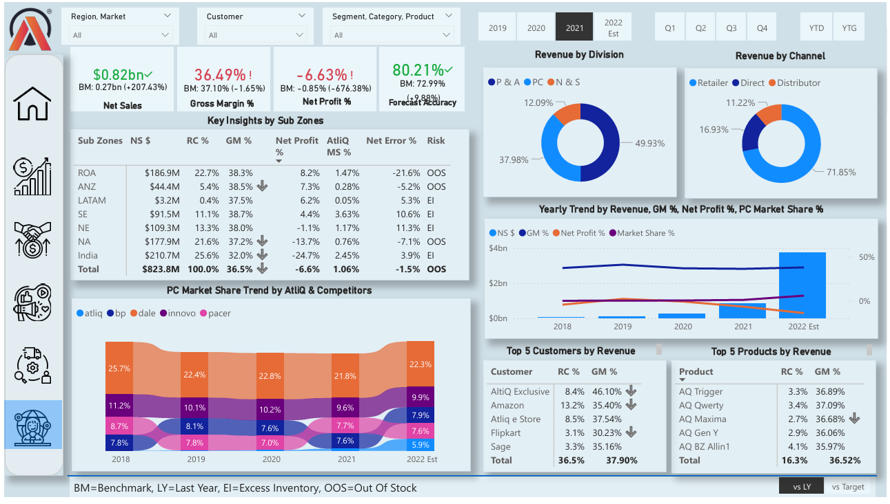

# Business-Insights-360-Dashboard
**Project Overview**
The Business Insights 360 Project delivers a comprehensive, data-driven analysis of AtliqQ Hardware's business performance across Latin America, focusing on key domains: Finance, Sales, Marketing, Supply Chain, and Executive Insights. Built in Power BI, this interactive dashboard empowers stakeholders to uncover trends, optimize operations, and make informed strategic decisions.

##Power BI Dashboard: [Interactive Dashboard]([https://app.powerbi.com/view?r=YOUR_POWER_BI_LINK_HERE](https://app.powerbi.com/view?r=eyJrIjoiZjNlMmViZWUtOGJiMi00MTkzLTkwMzAtNGQ1ZmMzMDdhNDMzIiwidCI6ImM2ZTU0OWIzLTVmNDUtNDAzMi1hYWU5LWQ0MjQ0ZGM1YjJjNCJ9))

**Key Objectives & Dashboard Views**

1. **Finance View**
    - Visualize critical financial KPIs through dynamic charts and user-controlled parameters.
    - Analyze financial health and performance trends to support fiscal strategy.

2. **Sales View**
    - Evaluate sales performance using scatter plots, donut charts, and product/customer-level insights.
    - Identify high-performing products and customer segments for revenue growth.

3. **Marketing View**
    - Deep-dive into marketing segment performance with waterfall charts and flexible data tables.
    - Track effectiveness of campaigns and channel contributions.

4. **Supply Chain View**
    -	Monitor key supply chain metrics using trend charts and detailed breakdowns.
    - Identify bottlenecks and streamline operations for improved efficiency.

5. **Executive View**
    - Tailored for decision-makers with top-level metrics, revenue trends, and strategic summaries.
    - Offers quick insights into business performance at a glance.

**Data Integration**

   - Integrated data from diverse sources including Excel, CSV files, and a MySQL database for seamless analysis across all business domains.
    
**Tools & Technologies**
- Power BI Desktop – Report development & visualization
- MySQL – Data extraction and querying
- Advanced Excel – Data pre-processing and validation
- DAX Language – Custom measures and logic implementation
- DAX Studio – Performance tuning and optimization
- Project Charter – Documentation of project scope, goals, and deliverables

**Power BI Features Applied**
- Created calculated columns and measures using DAX for custom KPI development
- Built data models to enable efficient relational analysis across multiple tables
- Implemented bookmarks to toggle between visuals for enhanced interactivity
- Designed page navigation using buttons for a user-friendly dashboard experience
- Developed a Date Table using M language for accurate time intelligence
- Built dynamic titles that update based on slicer and filter selections

